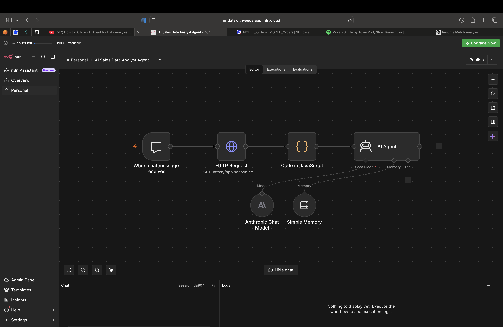
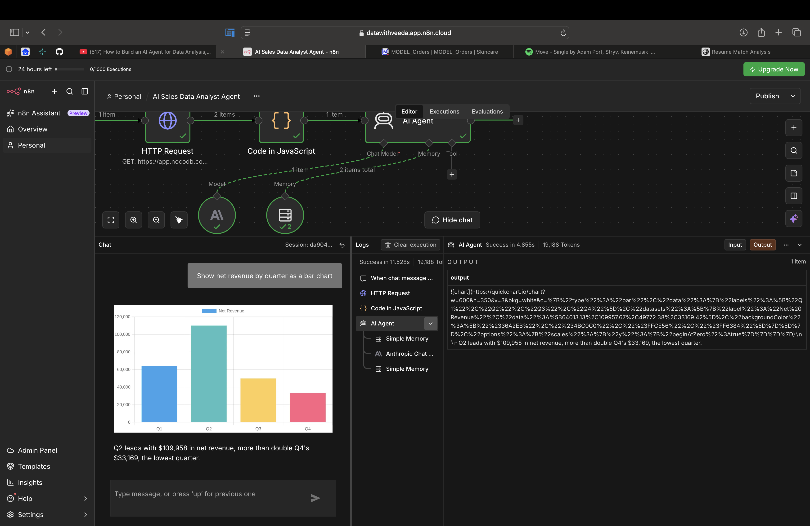
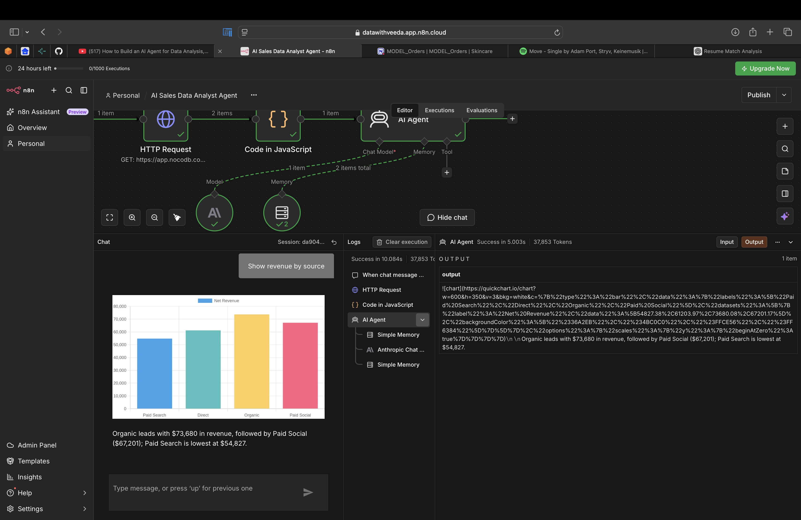

# AI Sales Data Analyst Agent

An n8n workflow that lets you ask questions about an orders table in plain English and get back short answers, tables, or bar charts.

## What it does

- Loads all 150 order rows from a NocoDB table through its REST API, paging through the results.
- Computes every total in code (revenue by customer type, quarter, source, region, campaign, product).
- Passes the raw rows and the exact totals to a Claude agent, which writes the answer.
- Draws charts by building a QuickChart image URL, so there is no separate chart tool to call.

## Architecture

Chat trigger -> HTTP Request (NocoDB, paginated) -> Code in JavaScript -> AI Agent (Claude + memory)

| Node | Role |
|---|---|
| When chat message received | Chat interface for questions |
| HTTP Request | Fetches the orders table from NocoDB, 2 pages for 150 rows |
| Code in JavaScript | Merges pages, cleans types, computes the totals |
| AI Agent | Claude answers using the data and the precomputed totals |
| Simple Memory | Keeps the conversation context for follow-up questions |

## Design decisions

- **Totals are computed in code, not by the model.** In early tests the model added up 150 rows itself and gave different numbers on different runs. Computing totals in a JavaScript step and handing them to the agent made the answers consistent.
- **Pagination.** NocoDB returns at most 100 rows per request, so the HTTP node requests page 2 as well. The Code node reports a row count to confirm all 150 rows loaded.
- **Charts as image URLs.** A tool call to a chart service kept failing. Having the agent reply with a QuickChart image URL is simpler and faster, with one fewer moving part. The system message enforces chart rules such as a zero-based axis, a white background and bar colors.

## Screenshots

Workflow canvas:

Answer with a table:

Answer with a chart:

## Setup

1. Create a NocoDB table with these columns: Order_ID, Order_Date, Year, Quarter, Customer_ID, Customer_Type, Source, Device, Region, Product_Exposure, Promo_Used, Discount_Rate, Net_Revenue, Items_Count, Distinct_Products, Campaign_ID, Entry_Experience.
2. In n8n, import `workflow.json`.
3. In the HTTP Request node, set your NocoDB table URL and replace `YOUR_NOCODB_TOKEN` with your API token.
4. In the Anthropic Chat Model node, add your Anthropic credential.
5. Open the chat panel and ask, for example: "Show net revenue by quarter as a bar chart."

## Tech

n8n, Claude (Anthropic), NocoDB, QuickChart, JavaScript
